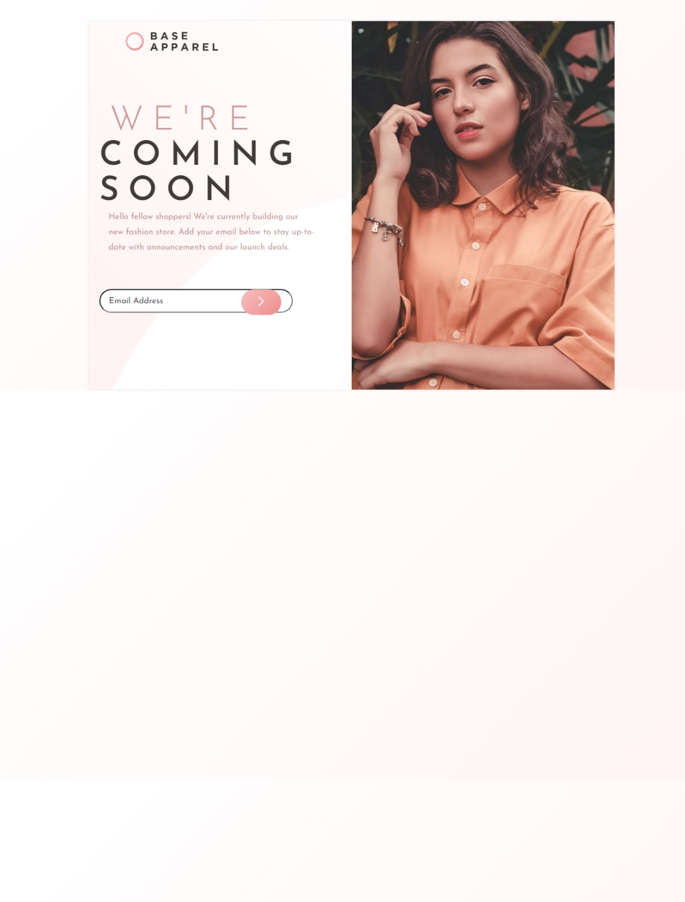

# Frontend Mentor - Base Apparel coming soon page solution
We were given this solution to work on it.
This is a solution to the [Base Apparel coming soon page challenge on Frontend Mentor](https://www.frontendmentor.io/challenges/base-apparel-coming-soon-page-5d46b47f8db8a7063f9331a0). Frontend Mentor challenges help you improve your coding skills by building realistic projects. 

## Table of content
Introduction:

I recently completed a web development project to create a coming soon page for Base Apparel, a new fashion store. The goal was to create a visually appealing and functional page that would generate excitement and capture email sign-ups from potential customers.

Objective:

The objective of the project was to design and develop a responsive coming soon page that aligned with Base Apparel's brand identity and conveyed key information to visitors while encouraging them to sign up for updates.

Design Phase:

During the design phase, I started by reviewing the provided design specifications, including the color palette, typography, and layout requirements. I used Figma to create wireframes and mockups, which helped me visualize the final design and iterate on different concepts.

I incorporated the provided color palette, which included desaturated red and soft red for primary colors, and dark grayish red for neutral tones. I also utilized linear gradients to enhance the visual appeal of the page.

For typography, I selected the Josefin Sans font family from Google Fonts, which provided a clean and modern look that complemented the overall design aesthetic.

Development Phase:

In the development phase, I structured the HTML markup to create two main 
 elements for the left and right sections of the page. I used CSS to style the elements according to the design specifications, ensuring proper alignment, spacing, and responsiveness.

To align the left and right sections inside the main container without any space between them, I utilized the display: flex; property with justify-content: space-between;. Additionally, I adjusted the widths of the sections and applied negative margins to remove any space between them.

During development, I encountered some challenges with browser compatibility and layout inconsistencies, particularly when testing on different devices and screen sizes. However, I was able to address these issues by  asking help from others.

Testing and Optimization:

After completing the initial development, I conducted extensive testing to ensure the page was responsive and compatible with various devices and browsers. I optimized images and code to improve performance and load times, which helped enhance the overall user experience.

Final Thoughts:

Overall, I'm pleased with the outcome of the project. I believe the coming soon page effectively conveys Base Apparel's brand identity and encourages visitors to sign up for updates. Working on this project was a valuable learning experience, and I'm proud of the result.

Conclusion:

In conclusion, creating the coming soon page for Base Apparel was an exciting and rewarding project. I'm grateful for the opportunity to contribute to the brand's online presence and look forward to future projects in web development.

### Screenshot

### Links
- Solution URL: [Add solution URL here](https://your-solution-url.com)
- Live Site URL: [Add live site URL here](https://your-live-site-url.com)

## Author

- Website - [Nasiphi ndzumo](https://www.your-site.com)
## Acknowledgments

 Got help from Thabanan and Simanga

